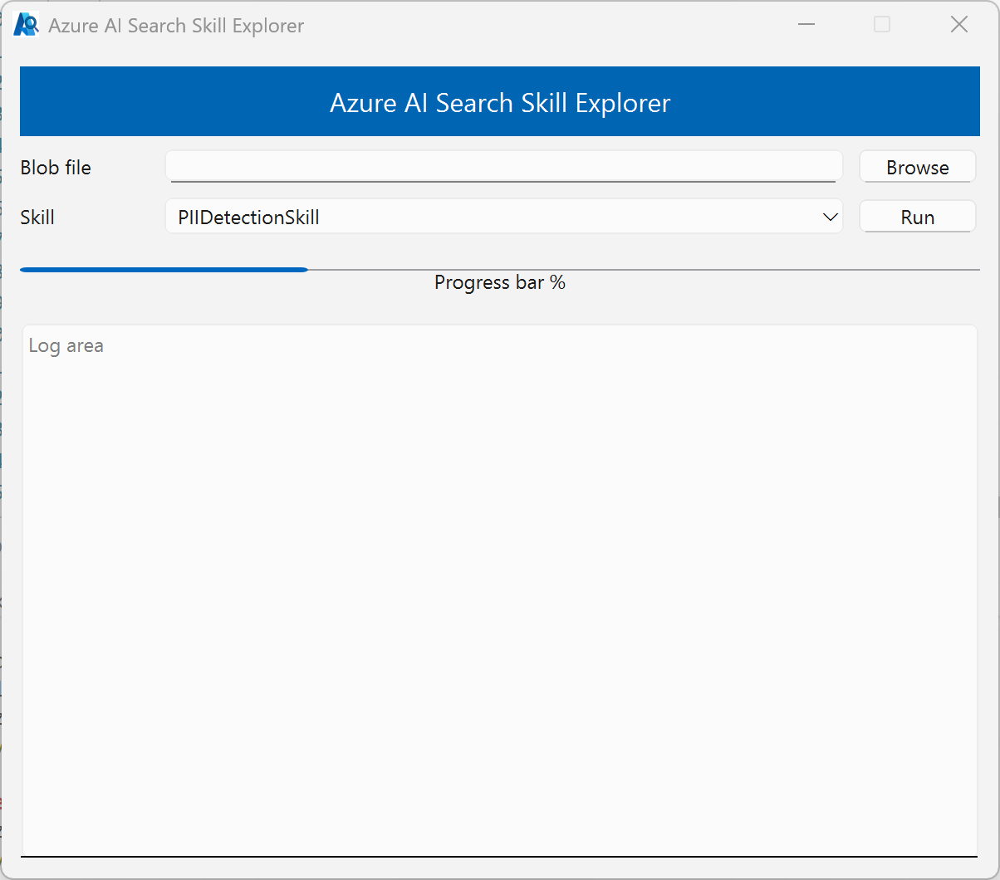

# Azure AI Search Built-in Skill Explorer

### Reference for Azure AI Search Skills

- [Skills for extra processing during indexing](https://learn.microsoft.com/en-us/azure/search/cognitive-search-predefined-skills): Skills list.
- [Skill dependencies](https://learn.microsoft.com/en-us/azure/search/cognitive-search-working-with-skillsets#skill-dependencies)

### Azure AI Search Python SDK

- [API Documentation](https://learn.microsoft.com/en-us/python/api/overview/azure/search-documents-readme?view=azure-python)
- [Release History](https://github.com/Azure/azure-sdk-for-python/blob/main/sdk/search/azure-search-documents/CHANGELOG.md): To install preview versions.

### Skillset

Configure `outputFieldMappings`:

The field should match the output name in the skillset.

- [Skillset concepts in Azure AI Search](https://learn.microsoft.com/en-us/azure/search/cognitive-search-working-with-skillsets)
- [Rest API](https://learn.microsoft.com/en-us/rest/api/searchservice/skillsets)
- [Skills Input & Output](https://learn.microsoft.com/en-us/azure/search/cognitive-search-predefined-skills): See the sections under this link.

```json
// The fieldMappings is for verbatim data—no enrichment or transformation involved. Basic indexing. Rename or retype fields.
"fieldMappings" : [
  {
    "sourceFieldName" : "SourceKey",
    "targetFieldName" : "IndexKey",
    "mappingFunction" : {
      "name" : "urlEncode"
    }
  }
]
```

For the above output in the skillset, you need to provide outputFieldMappings like this:

```json
// The outputFieldMappings is for in-memory enriched data - you’re persisting the results of AI processing. Skillsets / AI enrichment.
"outputFieldMappings": [
    {
      "sourceFieldName": "/document/parsedDate", # output of skillset
      "targetFieldName": "parsedDate" # Target index field name
    }
  ]
```

### UI




